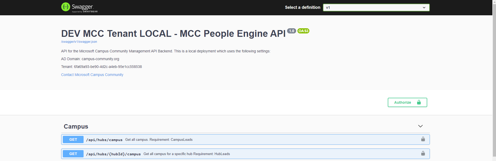

# Commasto People Engine - API

This project is the "People Engine" for the MCC Commasto app. The app is a .Net Core 3.1 WebAPI REST backend. It uses the [Graph API](https://developer.microsoft.com/de-de/graph/) to manage users, campus, and hubs.

|            |   |   |
|------------|---|---|
| Dev        | [](https://dev.azure.com/campusCommunity/commasto/_build/latest?definitionId=1) | [](https://vsrm.dev.azure.com/campusCommunity/_apis/public/Release/badge/6cdf692a-30de-480f-9c2e-67925a7d66b3/1/1)  |
| Production | [](https://dev.azure.com/campusCommunity/commasto/_build/latest?definitionId=2) | [](https://vsrm.dev.azure.com/campusCommunity/_apis/public/Release/badge/6cdf692a-30de-480f-9c2e-67925a7d66b3/2/2) |


## Installation

### Prerequisites

1. First, you need to download [Visual Studio](https://visualstudio.microsoft.com/) or [VSCode](https://code.visualstudio.com/).
2. Download [.Net Core 3.1 SDK](https://dotnet.microsoft.com/download/dotnet-core/3.1)
3. Clone the project.
4. You need access to our development tenant to start developing. For this purpose we have created a [Microsoft Form](https://forms.office.com/Pages/ResponsePage.aspx?id=k5qmb5C-LE2k65XhzFWFOOaNAWppoEBFg7yys3HUwQJUMFFBSVJSTU5XRko0MkkyMEszSzlKWjY5QS4u). This will do two things: Add you to our [Commasto MCC App Teams](https://teams.microsoft.com/l/team/19%3a741e24bef66c4ee4ab3076a79f1c2ac4%40thread.tacv2/conversations?groupId=5a945ddc-fabf-4825-9d31-6017c8d4d179&tenantId=6fa69a93-be90-4d2c-a4eb-95e1cc558538) and invite your @campus-community user to our test AD.
5. Once you have completed the Forms you should receive two emails: One email to notify you that you've been invited to our development AD and one mail which contains the appSettings configuration so that you can start developing locally. Make sure to insert the secret from the mail into the `appSettings.Development.json` file.

### Database

The People API uses a database to keep track of hubs and campus. While you can run the project without any local database not all functionality will work. Therefore, it is advisable to install a local database on your development machine.

1. If you have not already done this, install the **ef** core tools. For .Net Core 2.x this was included in the SDK but for .Net Core 3.x this is a separate download. To download the tools simply run 
```dotnet tool install --global dotnet-ef```.
2. Before continuing, make sure you can build the solution.
3. Go to the API project located under `projectRoot/Microsoft.CampusCommunity.Api`.
4. To update / create your database locally run `dotnet ef database update`. **For macOS or other linux based operating systems this command will not work. Please refer to the next section to create a database.**
5. Use your favorite local DB tool to verify the creation of the database locally. On Windows I use either the free [SQL Server Management Studio](https://docs.microsoft.com/en-us/sql/ssms/download-sql-server-management-studio-ssms?view=sql-server-ver15) or the SQL Server object explorer which is included in Visual Studio. There is also a [free extension](https://marketplace.visualstudio.com/items?itemName=ms-mssql.mssql) for VS Code.


#### For Unix based Operating Systems

The default connection string will not work on machines that do not run Windows since LocalDB is not supported. Follow this guide to install an alternative

1. Download and install [SQLite](https://www.sqlite.org/index.html) if it is not already part of your system. For example, macOS uses SQLite for most native applications so it's already part of the system. However, you can use a [VS Code Extension](https://sqlitebrowser.org) or an application like [Db Browser for SQLLite](https://sqlitebrowser.org) to monitor your local SQLite database(s).
2. Go to your `appsettings.Development.json` and change the connection string and database type:

```json
{
	"ConnectionStrings": {
	"Default": "Data Source=Mcc.PeopleApi.db"
	},
	"DatabaseType": "sqlite",
	...
}
```

3. Run `dotnet ef database update` in your `projectRoot/Microsoft.CampusCommunity.Api` folder.


### Development


1. Please **do not** develop on the dev branch. Instead, create your own feature branch. Once you are done you can test your changes by merging to the "`test`" branch. This will trigger a build to [https://commasto-api-test.azurewebsites.net](https://commasto-api-test.azurewebsites.net/swagger). Please make sure nobody else is currently testing their app since it will overwrite everything.
2. Once you are certain your code works you can create a PR. Make sure to describe your changes and reference the issue if applicable.
3. Happy coding :)

## Usage


The REST API that the application creates is exposed as a [Swagger Page](https://swagger.io/). Click on "Authorize" to access the API.

Use this table to find out the URLs for the swagger pages:

| Environment       | URL |
|-------------------|-----|
| Local             | [https://localhost:44306/swagger](https://localhost:44306/swagger/index.html)   |
| Online Dev        | [https://commasto-api-dev.azurewebsites.net/swagger](https://commasto-api-dev.azurewebsites.net/swagger/index.html)   |
| Online Production | [https://commasto-api.azurewebsites.net/swagger](https://commasto-api.azurewebsites.net/swagger/index.html)   |
| Online Testing | [https://commasto-api-test.azurewebsites.net/swagger](https://commasto-api-test.azurewebsites.net/swagger/index.html)   |

## Contributing
Pull requests are welcome. For major changes, please open an issue first to discuss what you would like to change.

Please make sure to update tests as appropriate.

## License
[MIT](https://choosealicense.com/licenses/mit/)